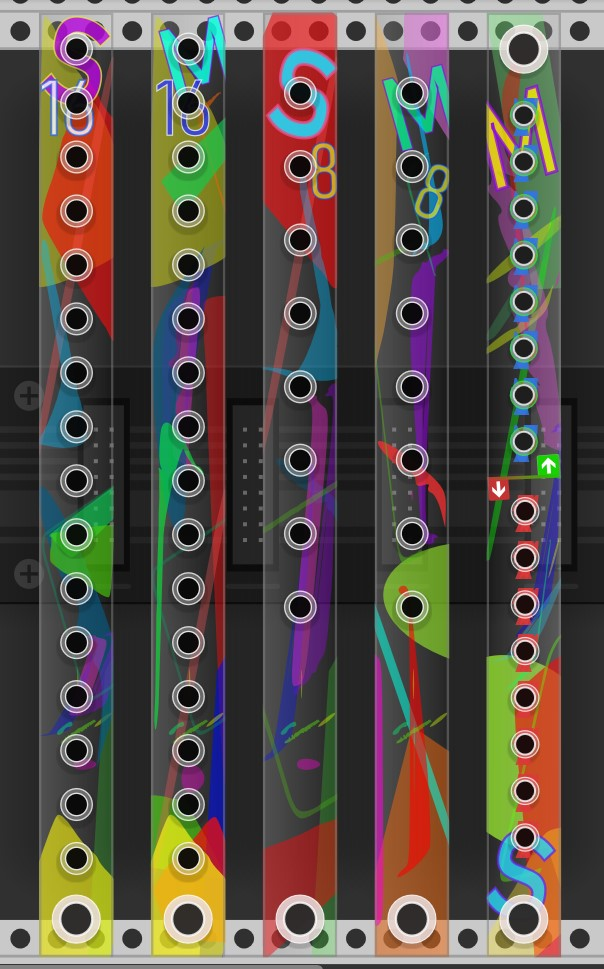
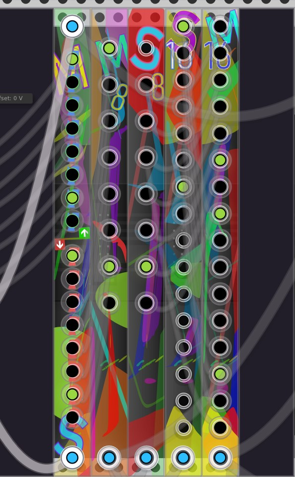
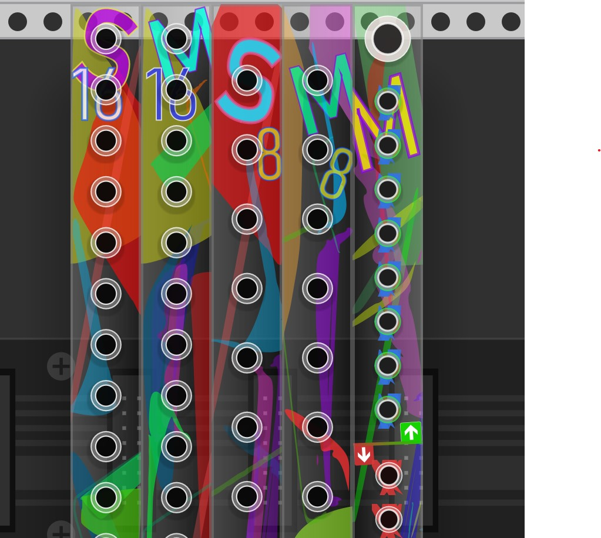
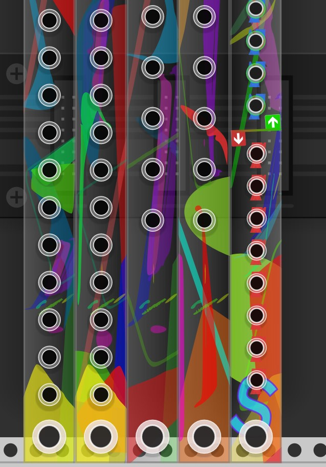

### Merge/Split Modules for VCV-Rack
* **2HP 8 & 16 Channels polyphonic cable Merge**
* **2HP 8 & 16 Channels polyphonic cable Split**
* **2HP 8 & 8 Channels polyphonic cable Merge/Split**
*Based on source code from 21kHz.*

Slim form factor Merge/Split modules for saving Rack-space in complex patches. 
Design is still a rough sketch. 

*(to-do: color blending improvements, adjust port placements, improve port visibility, make space for module grabbing at top/bottom)*

just an amateurish copypasteedit project for my personal needs.

* **Get VCV Rack** (free) at [vcvrack.com](http://vcvrack.com)
* **My FB:** [Johann Asbjoernson](https://www.facebook.com/asbjoernson)
* **YouTube:** [YT channel](https://www.youtube.com/channel/UCI0k8-TxcRn5xqFGdGfNQlg/videos)
-------

